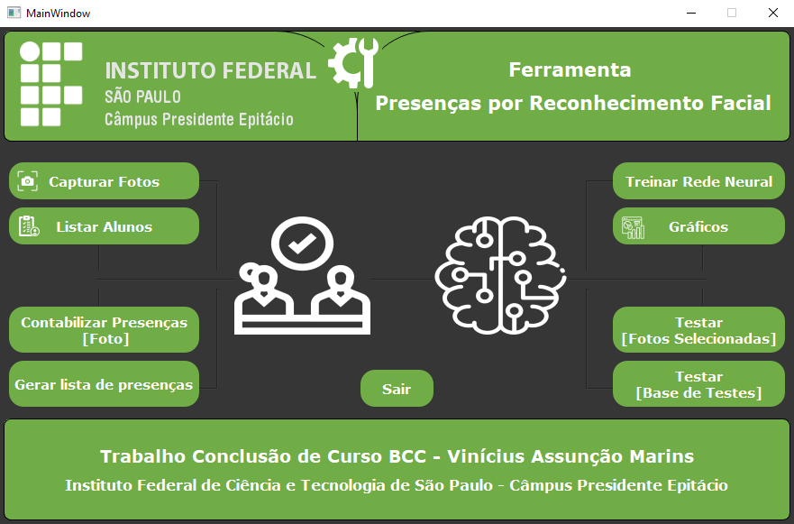

# **Ferramenta para controle de presenças de alunos por reconhecimento facial**

Este é o projeto do meu Trabalho de Conclusão de Curso em Bacharelado em Ciência da Computação.

Você pode conferir o artigo científico do trabalho no link abaixo:

**[>> Artigo Científico <<](./to_github/Artigo-Científico.pdf)**

## Stack utilizada

**Tecnologias/Ferramentas:** QtDesigner, Python v3.8.10.

**Bibliotecas:**

- OpenCV
- Dlib
- TensorFlow
- Keras
- Sklearn
- PyQt5
- SQLAlchemy

## Funcionalidades

- Capturar fotos
- Listar alunos
- Contabilizar presenças através de fotos
- Gerar lista de presenças
- Treinar rede neural
- Gerar gráficos de treinamento do modelo
- Testar modelo com fotos selecionadas
- Testar modelo com base de testes

## Instalação (Windows)

### Realizar a instalação das bibliotecas citadas anteriormente

### OpenCV
```bash
pip install opencv-python
```

### Dlib
- [Instalar CMake](https://cmake.org/download/)
- [Instalar Visual Studio](https://visualstudio.microsoft.com/visual-cpp-build-tools/)

Após as instalações:
```bash
pip install cmake
pip install dlib
```

###  TensorFlow
```bash
pip install tensorflow
```

### Keras
Pode-se utilizar o pacote Keras da lib TensorFlow
```python
from tensorflow import keras
```

### Sklearn
```bash
pip install scikit-learn
```

### PyQt5
```bash
pip install PyQt5
```

### SQLAlchemy
```bash
pip install SQLAlchemy
```

## Screenshots

### Tela Principal da Ferramenta
<p>
  
</p>
